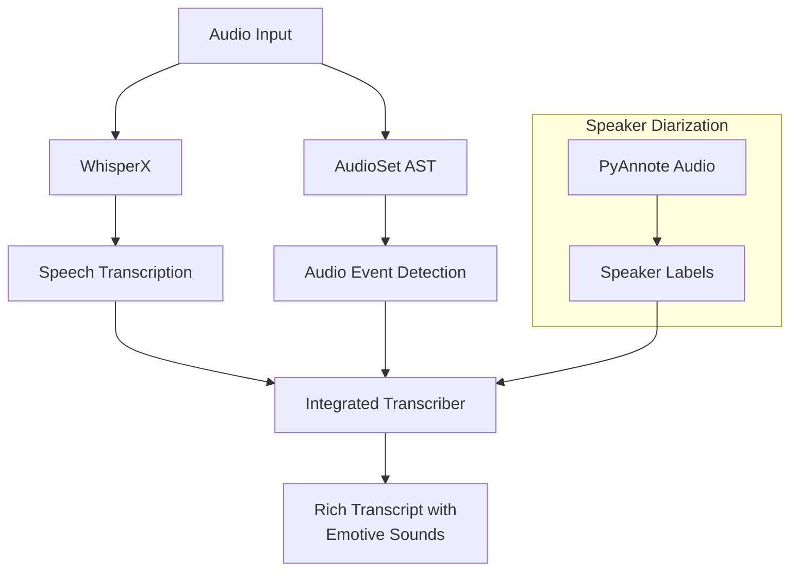

# SONATA: SOund and Narrative Advanced Transcription Assistant
{: .fs-9 }

SONATA is an advanced audio transcription system that captures human expressions including emotive sounds and non-verbal cues, providing rich and contextual transcription results.
{: .fs-6 .fw-300 }

[View on GitHub](https://github.com/hwk06023/SONATA){: .btn .btn-primary .fs-5 .mb-4 .mb-md-0 .mr-2 }
[Get Started](#quick-start){: .btn .fs-5 .mb-4 .mb-md-0 }

<div class="language-selector">
Language: 
<a href="#">English</a> |
<a href="#" class="disabled">한국어 (Coming Soon)</a> |
<a href="#" class="disabled">中文 (Coming Soon)</a> |
<a href="#" class="disabled">日本語 (Coming Soon)</a>
</div>

---

## System Architecture
{: .mt-5 }

The following diagram illustrates the SONATA system architecture:



## Features

- 🎙️ High-accuracy speech-to-text transcription using WhisperX
- 😀 Recognition of 523+ emotive sounds and non-verbal cues
- 🌍 Multi-language support with 10 languages
- 👥 Speaker diarization for multi-speaker transcription (online and offline modes)
- ⏱️ Rich timestamp information at the word level
- 🔊 Customizable audio event detection thresholds

## Quick Start
{: #quick-start }

### Installation

```bash
pip install sonata-asr
```

### Basic Usage

**Python API:**

```python
from sonata.core.transcriber import IntegratedTranscriber

# Initialize the transcriber
transcriber = IntegratedTranscriber(asr_model="large-v3", device="cpu")

# Transcribe an audio file
result = transcriber.process_audio("path/to/audio.wav", language="en")
print(result["integrated_transcript"]["plain_text"])
```

**CLI Command:**

```bash
# Basic usage
sonata-asr path/to/audio.wav

# With speaker diarization
sonata-asr path/to/audio.wav --diarize --hf-token YOUR_HUGGINGFACE_TOKEN
```

## Sample Output

```json
{
  "integrated_transcript": {
    "plain_text": "Hello everyone [laughter] I'm excited to show you SONATA today.",
    "rich_text": [
      {"type": "word", "content": "Hello", "start": 0.5, "end": 0.7},
      {"type": "word", "content": "everyone", "start": 0.8, "end": 1.2},
      {"type": "audio_event", "event_type": "laughter", "start": 1.3, "end": 2.1, "confidence": 0.92},
      {"type": "word", "content": "I'm", "start": 2.3, "end": 2.4},
      {"type": "word", "content": "excited", "start": 2.5, "end": 2.9},
      {"type": "word", "content": "to", "start": 3.0, "end": 3.1},
      {"type": "word", "content": "show", "start": 3.2, "end": 3.4},
      {"type": "word", "content": "you", "start": 3.5, "end": 3.6},
      {"type": "word", "content": "SONATA", "start": 3.7, "end": 4.0},
      {"type": "word", "content": "today", "start": 4.1, "end": 4.3}
    ]
  }
}
```

## Documentation

- [Features](https://github.com/hwk06023/SONATA/blob/main/docs/FEATURES.md)
- [Usage Guide](https://github.com/hwk06023/SONATA/blob/main/docs/USAGE.md)
- [CLI Reference](https://github.com/hwk06023/SONATA/blob/main/docs/CLI.md)
- [Audio Event Detection](https://github.com/hwk06023/SONATA/blob/main/docs/AUDIO_EVENTS.md)
- [Offline Diarization](https://github.com/hwk06023/SONATA/blob/main/docs/OFFLINE_DIARIZATION.md) 