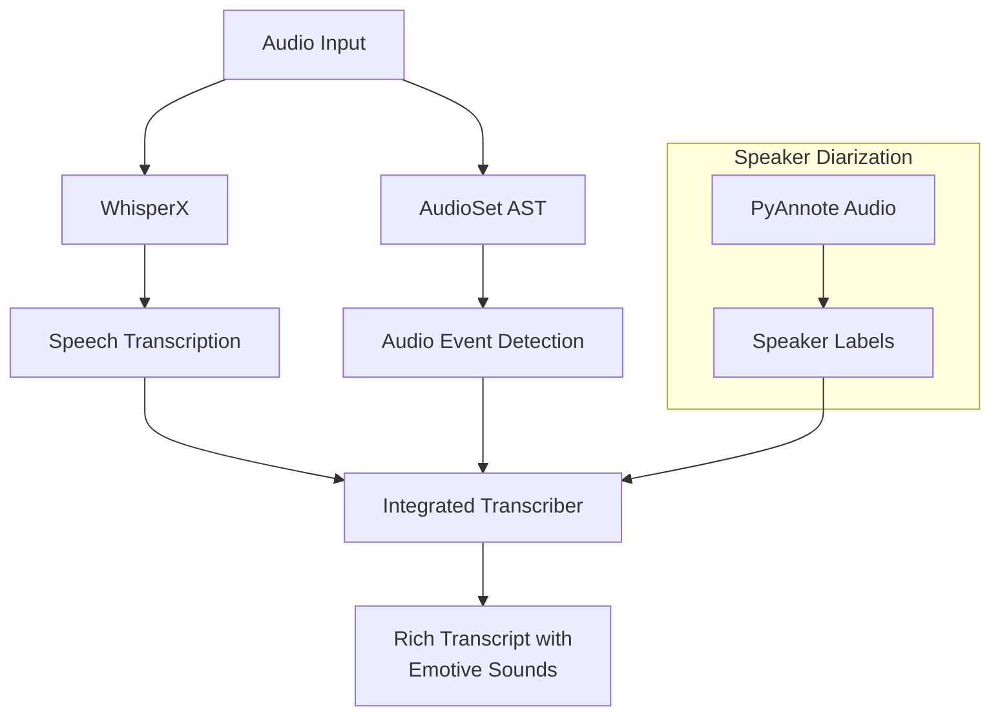

# SONATA: SOund and Narrative Advanced Transcription Assistant
{: .fs-9 }

SONATA is an advanced audio transcription system that captures human expressions including emotive sounds and non-verbal cues, providing rich and contextual transcription results.
{: .fs-6 .fw-300 }

[View on GitHub](https://github.com/hwk06023/SONATA){: .btn .btn-primary .fs-5 .mb-4 .mb-md-0 .mr-2 }
[Get Started](#quick-start){: .btn .fs-5 .mb-4 .mb-md-0 }

<div class="language-selector">
Language: 
<a href="#">English</a> |
<a href="#" class="disabled">한국어 (Coming Soon)</a> |
<a href="#" class="disabled">中文 (Coming Soon)</a> |
<a href="#" class="disabled">日本語 (Coming Soon)</a>
</div>

---

## System Architecture
{: .mt-5 }

The following diagram illustrates the SONATA system architecture:



## Features

<div class="feature-grid">
  <div class="feature-card">
    <div class="feature-icon">
      <i class="fas fa-microphone"></i>
    </div>
    <h3>Speech Recognition</h3>
    <p>High-accuracy speech-to-text transcription powered by WhisperX with support for multiple languages.</p>
  </div>
  
  <div class="feature-card">
    <div class="feature-icon">
      <i class="fas fa-smile"></i>
    </div>
    <h3>Emotive Sounds</h3>
    <p>Recognition of 523+ emotive sounds and non-verbal cues for more human-like transcripts.</p>
  </div>
  
  <div class="feature-card">
    <div class="feature-icon">
      <i class="fas fa-globe"></i>
    </div>
    <h3>Multi-language</h3>
    <p>Support for 10 languages including English, Korean, Chinese, Japanese, and major European languages.</p>
  </div>
  
  <div class="feature-card">
    <div class="feature-icon">
      <i class="fas fa-users"></i>
    </div>
    <h3>Speaker Diarization</h3>
    <p>Identify and label different speakers in conversations with online and offline modes.</p>
  </div>
  
  <div class="feature-card">
    <div class="feature-icon">
      <i class="fas fa-clock"></i>
    </div>
    <h3>Rich Timestamps</h3>
    <p>Precise timing information at the word level for perfect audio alignment.</p>
  </div>
  
  <div class="feature-card">
    <div class="feature-icon">
      <i class="fas fa-sliders-h"></i>
    </div>
    <h3>Customizable</h3>
    <p>Adjustable audio event detection thresholds and flexible output formats.</p>
  </div>
</div>

## Quick Start
{: #quick-start }

### Installation

```bash
pip install sonata-asr
```

### Basic Usage

<div class="tab-container">
  <div class="tab-nav">
    <button class="tab-item">Python API</button>
    <button class="tab-item">CLI Command</button>
  </div>
  <div class="tab-content">
    <div class="tab-pane">
```python
from sonata.core.transcriber import IntegratedTranscriber

# Initialize the transcriber
transcriber = IntegratedTranscriber(asr_model="large-v3", device="cpu")

# Transcribe an audio file
result = transcriber.process_audio("path/to/audio.wav", language="en")
print(result["integrated_transcript"]["plain_text"])
```
    </div>
    <div class="tab-pane">
```bash
# Basic usage
sonata-asr path/to/audio.wav

# With speaker diarization
sonata-asr path/to/audio.wav --diarize --hf-token YOUR_HUGGINGFACE_TOKEN
```
    </div>
  </div>
</div>

## Sample Output

```json
{
  "integrated_transcript": {
    "plain_text": "Hello everyone [laughter] I'm excited to show you SONATA today.",
    "rich_text": [
      {"type": "word", "content": "Hello", "start": 0.5, "end": 0.7},
      {"type": "word", "content": "everyone", "start": 0.8, "end": 1.2},
      {"type": "audio_event", "event_type": "laughter", "start": 1.3, "end": 2.1, "confidence": 0.92},
      {"type": "word", "content": "I'm", "start": 2.3, "end": 2.4},
      {"type": "word", "content": "excited", "start": 2.5, "end": 2.9},
      {"type": "word", "content": "to", "start": 3.0, "end": 3.1},
      {"type": "word", "content": "show", "start": 3.2, "end": 3.4},
      {"type": "word", "content": "you", "start": 3.5, "end": 3.6},
      {"type": "word", "content": "SONATA", "start": 3.7, "end": 4.0},
      {"type": "word", "content": "today", "start": 4.1, "end": 4.3}
    ]
  }
}
```

<div class="callout note">
  <p>Need help? Have questions? Join our <a href="https://github.com/hwk06023/SONATA/discussions" target="_blank">community discussions</a> or open an issue on GitHub.</p>
</div>

## Documentation

<div class="card-grid">
  <a href="{{ '/FEATURES' | relative_url }}" class="card-link">
    <div class="card">
      <h3><i class="fas fa-list-ul"></i> Features</h3>
      <p>Detailed overview of SONATA's capabilities and features</p>
    </div>
  </a>
  
  <a href="{{ '/USAGE' | relative_url }}" class="card-link">
    <div class="card">
      <h3><i class="fas fa-book"></i> Usage Guide</h3>
      <p>Comprehensive guide to using SONATA in your projects</p>
    </div>
  </a>
  
  <a href="{{ '/CLI' | relative_url }}" class="card-link">
    <div class="card">
      <h3><i class="fas fa-terminal"></i> CLI Reference</h3>
      <p>Command-line interface documentation and examples</p>
    </div>
  </a>
  
  <a href="{{ '/AUDIO_EVENTS' | relative_url }}" class="card-link">
    <div class="card">
      <h3><i class="fas fa-volume-up"></i> Audio Events</h3>
      <p>List of supported audio events and detection capabilities</p>
    </div>
  </a>
  
  <a href="{{ '/OFFLINE_DIARIZATION' | relative_url }}" class="card-link">
    <div class="card">
      <h3><i class="fas fa-users-cog"></i> Offline Diarization</h3>
      <p>Guide to using speaker diarization in offline mode</p>
    </div>
  </a>
</div> 